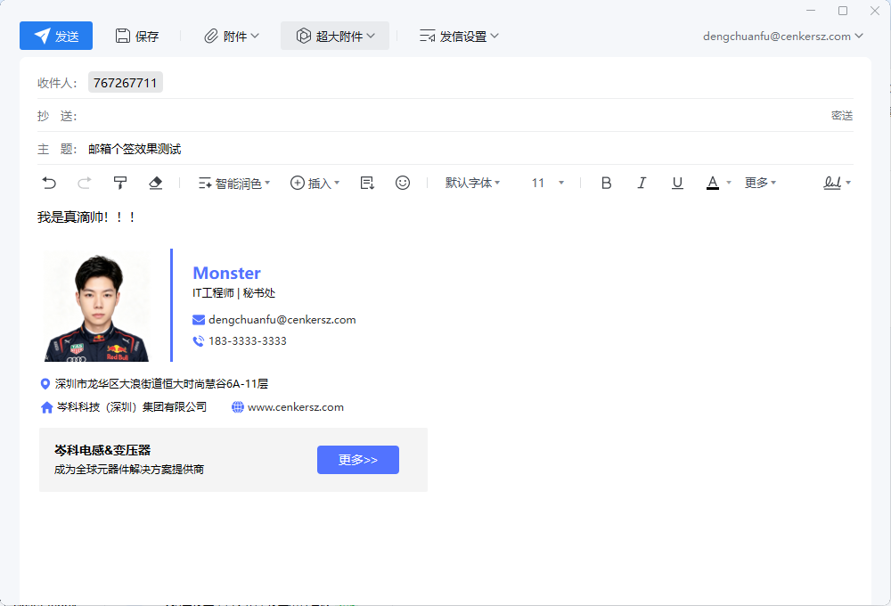

# Email Signature Generator

邮件签名生成器。左侧填写个人、公司和联系方式，右侧实时预览签名效果，并支持复制或下载最终 HTML。

当前版本：V3.0。

V2.0 已将上传图片改为又拍云云存储：用户上传图片后，服务端会自动上传到又拍云，生成的签名 HTML 使用云存储图片 URL，避免 base64 图片过长导致邮箱签名字数超限。

V3.0 新增 Docker 部署支持，可通过 Dockerfile 或 Docker Compose 快速运行，并可发布到 Docker Hub。

## 效果图



## 功能

- 实时预览邮件签名效果
- 复制最终 HTML
- 下载最终 HTML
- 上传图片自动同步到又拍云云存储
- 导出的 HTML 使用云端图片地址
- 支持腾讯企业邮箱等邮箱签名场景

## 环境要求

- Node.js 16 或以上
- 一个可用的又拍云云存储服务
- 一个可 HTTPS 访问的又拍云加速域名

## 部署步骤

1. 拉取代码

```bash
git clone https://github.com/dengchuanfu/email-signature.git
cd email-signature
```

2. 创建环境变量文件

```bash
cp .env.example .env
```

Windows PowerShell 可使用：

```powershell
Copy-Item .env.example .env
```

3. 修改 `.env`

```env
UPYUN_BUCKET=your-bucket
UPYUN_OPERATOR=your-operator
UPYUN_PASSWORD=your-operator-password
UPYUN_PUBLIC_BASE_URL=https://img.example.com
UPYUN_UPLOAD_HOST=https://v0.api.upyun.com
PORT=3000
MAX_UPLOAD_BYTES=8388608
```

4. 启动服务

```bash
npm start
```

5. 打开页面

```text
http://localhost:3000
```

## Docker 部署

1. 准备环境变量

```bash
cp .env.example .env
```

Windows PowerShell 可使用：

```powershell
Copy-Item .env.example .env
```

然后按实际又拍云配置修改 `.env`。

2. 使用 Docker Compose 启动

```bash
docker compose up -d --build
```

3. 或使用 Docker 命令启动

```bash
docker build -t dengchuanfu/email-signature:3.0.0 .
docker run -d --name email-signature --env-file .env -p 3000:3000 dengchuanfu/email-signature:3.0.0
```

4. 打开页面

```text
http://localhost:3000
```

## 发布到 Docker Hub

镜像仓库地址：

```text
https://hub.docker.com/r/dengchuanfu/email-signature
```

Docker Hub Overview 内容维护在：

```text
DOCKER_HUB_OVERVIEW.md
```

发布命令：

```bash
docker login
docker build -t dengchuanfu/email-signature:3.0.0 -t dengchuanfu/email-signature:latest .
docker push dengchuanfu/email-signature:3.0.0
docker push dengchuanfu/email-signature:latest
```

## 参数说明

`UPYUN_BUCKET`

又拍云云存储服务名称。

`UPYUN_OPERATOR`

又拍云操作员名称。操作员需要有上传权限。

`UPYUN_PASSWORD`

又拍云操作员密码。该值只放在 `.env` 中，不要提交到 Git 仓库。

`UPYUN_PUBLIC_BASE_URL`

图片最终对外访问的域名，必须能直接访问上传后的图片。推荐使用已配置 HTTPS 证书的自定义域名，例如：

```env
UPYUN_PUBLIC_BASE_URL=https://img.ffbf.top
```

腾讯企业邮箱等 HTTPS 页面可能会拦截 HTTP 图片，因此正式使用时建议一定使用 HTTPS。

`UPYUN_UPLOAD_HOST`

又拍云上传接口地址，默认：

```env
UPYUN_UPLOAD_HOST=https://v0.api.upyun.com
```

`PORT`

本地服务端口，默认 `3000`。

`MAX_UPLOAD_BYTES`

单张图片最大上传大小，单位为字节。默认 `8388608`，即 8 MB。

## 腾讯企业邮箱使用

1. 启动本项目服务。
2. 打开 `http://localhost:3000`。
3. 上传签名图片，等待上传完成。
4. 确认导出的 HTML 中图片地址为 HTTPS 又拍云地址。
5. 点击“复制 HTML”。
6. 打开腾讯企业邮箱签名设置。
7. 切换到 HTML 编辑或源码编辑模式，粘贴复制的 HTML。
8. 保存签名并发送测试邮件确认图片正常加载。

## 注意事项

- 不要直接双击打开 `index.html`，否则没有后端上传接口，图片无法上传到又拍云。
- `.env` 包含又拍云操作员密码，已被 `.gitignore` 忽略，不要手动提交。
- `.env.example` 只用于展示配置格式，不要填写真实密码后提交。
- 如果图片地址浏览器可以访问，但邮箱签名中不显示，优先检查图片 URL 是否为有效 HTTPS。
- 修改 `.env` 后需要重启服务才会生效。
